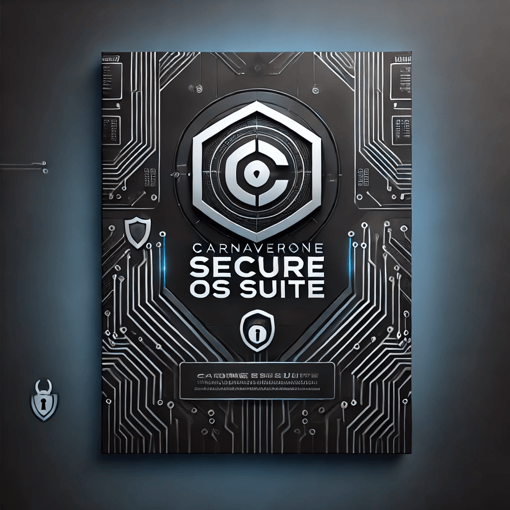

Bienvenue dans la **Carnaverone Secure OS Suite**, une puissante collection de scripts d'automatisation conçue pour configurer, sécuriser et optimiser votre environnement de développement sur plusieurs systèmes d'exploitation.

---------------------------------------------------------------------------------
<p align="center">
  
</p>

---------------------------------------------------------------------------------
Full documentation and usage guide / Documentation complète et guide d'utilisation
---------------------------------------------------------------------------------
---------------------------------------------------------------------------------
# 📘 **CARNAVERONE SECURE OS SUITE**
---------------------------------------------------------------------------------
Welcome to the Carnaverone Secure OS Suite, a powerful collection of automation scripts designed to configure, secure, and optimize your development environment across multiple operating systems. This suite provides enhanced security, automation, and ease of use for both developers and IT professionals.
This suite offers a seamless setup experience for development, security, and automation on the most popular operating systems.
---------------------------------------------------------------------------------
Bienvenue dans la Carnaverone Secure OS Suite, une puissante collection de scripts d'automatisation conçue pour configurer, sécuriser et optimiser votre environnement de développement sur plusieurs systèmes d'exploitation. Cette suite offre une sécurité renforcée, une automatisation et une facilité d'utilisation pour les développeurs et les professionnels de l'informatique.
Cette suite offre une expérience de configuration transparente pour le développement, la sécurité et l'automatisation sur les systèmes d'exploitation les plus populaires.
---------------------------------------------------------------------------------
---------------------------------------------------------------------------------
🛡️ Supported Operating Systems / Systèmes d'exploitation pris en charge

This repository contains **8 complete setup and configuration scripts** 
- **Ubuntu**  
- **Arch Linux**  
- **Pop!_OS**  
- **Debian**  
- **Fedora**  
- **CentOS/Rocky/AlmaLinux**  
- **macOS**  
- **Windows (via WSL)**  


------------------------------------------------------------------------------
---------------------------------------------------------------------------------
These scripts automatically install and configure a **fully secure development environment** with:  
------------------------------------------------------------------------------
Ces scripts installent et configurent automatiquement un environnement de développement entièrement sécurisé avec :
------------------------------------------------------------------------------
------------------------------------------------------------------------------

- **Text-to-Speech (TTS) Tools**  
- **Flask TTS API**  
- **Virtualization (QEMU, VirtualBox)**  
- **Docker & Docker Compose**  
- **Advanced Security Setup (UFW, Fail2Ban, Root Lockout)**  

--- 

---

## 📂 **REPOSITORY CONTENT**  
| **File**                          | **Description**                          |
|-----------------------------------|------------------------------------------|
| **`setup_full_ubuntu.sh`**         | Full setup script for **Ubuntu**         |
| **`setup_full_arch.sh`**           | Full setup script for **Arch Linux**     |
| **`setup_full_popos.sh`**          | Full setup script for **Pop!_OS**        |
| **`setup_full_debian.sh`**         | Full setup script for **Debian**         |
| **`setup_full_fedora.sh`**         | Full setup script for **Fedora**         |
| **`setup_full_centos.sh`**         | Full setup script for **CentOS/Rocky/AlmaLinux** |
| **`setup_full_macos.sh`**          | Full setup script for **macOS**          |
| **`setup_full_windows_wsl.sh`**    | Full setup script for **Windows (via WSL)** |
| **`README.md`**                    | Full documentation and usage guide      |

---
---------------------------------------------------------------------------------
## 📋 **EXECUTION INSTRUCTIONS**  
---------------------------------------------------------------------------------
### 🚀 **STEP 1: GRANT EXECUTION PERMISSIONS**  
Run the following command to make the scripts executable:  
```bash
chmod +x setup_full_ubuntu.sh setup_full_arch.sh setup_full_popos.sh setup_full_debian.sh setup_full_fedora.sh setup_full_centos.sh setup_full_macos.sh setup_full_windows_wsl.sh
```

---
---------------------------------------------------------------------------------
### 🚀 **STEP 2: EXECUTE THE SCRIPT FOR YOUR OS**  
Run the appropriate script depending on your operating system:  

**🔷 FOR UBUNTU:**  
```bash
./setup_full_ubuntu.sh
```

**🔷 FOR ARCH LINUX:**  
```bash
./setup_full_arch.sh
```

**🔷 FOR POP!_OS:**  
```bash
./setup_full_popos.sh
```

**🔷 FOR DEBIAN:**  
```bash
./setup_full_debian.sh
```

**🔷 FOR FEDORA:**  
```bash
./setup_full_fedora.sh
```

**🔷 FOR CENTOS/ROCKY/ALMALINUX:**  
```bash
./setup_full_centos.sh
```

**🔷 FOR MACOS:**  
```bash
./setup_full_macos.sh
```

**🔷 FOR WINDOWS (via WSL):**  
```bash
./setup_full_windows_wsl.sh
```

---
---------------------------------------------------------------------------------
### 🚀 **STEP 3: VERIFY THE LOG FILE**  
After the script completes, review the log file to verify the success of the installation:  
```bash
cat /mnt/data/testuser/setup_log.txt
```

---

---
---------------------------------------------------------------------------------
---------------------------------------------------------------------------------
<p align="center">
  
</p>
------------------------------------------------------------------------------------------------------------------------------------------------------------------

---

## 🚀 **SCRIPT FEATURES**  

| **Feature**               | **Description**                            |
|--------------------------|---------------------------------------------|
| 📁 **Environment Setup**   | TTS, security, Docker, Flask, virtualization |
| 📜 **Log File**            | Detailed log of every action in the setup  |
| ✅ **Automatic Tests**     | Check directories, permissions, and file status |
| 🔐 **Advanced Security**   | UFW, Fail2Ban, root lockout, AppArmor      |
| 📡 **Flask TTS API**       | API to generate audio files via HTTP       |

---

## 📡 **FLASK TTS API USAGE**  

The Flask TTS server allows **audio file generation** from a simple HTTP POST request.  
The **Flask server is a systemd or launchctl service** that runs automatically.  

---

### 🧑‍💻 **API USAGE EXAMPLE**  
**Endpoint**: `http://localhost:5000/tts`  
**Method**: `POST`  
**Request Body (JSON)**:  
```json
{
    "text": "Hello, I am a voice generated by TTS"
}
```

**Example cURL Command**:  
```bash
curl -X POST http://localhost:5000/tts     -H "Content-Type: application/json"     -d '{"text":"Hello, I am a voice generated by TTS"}' --output output.wav
```

---

## 🖼️ **TTS API Overview**  


---

## 🧪 **TESTS AND VERIFICATIONS**  
- ✅ **Log file verification**  
- ✅ **File and directory permission checks**  
- ✅ **Service status checks**  
- ✅ **TTS API endpoint testing**  

---

## 📂 **FILE STRUCTURE**  

```
📦 /carnaverone-secure-os-suite
├── /images/                    # Images used in the README
│   ├── script-overview.png     # Overview of scripts
│   ├── script-execution.png    # Example of script execution
│   └── tts-api-example.png     # Flask TTS API example
├── setup_full_ubuntu.sh        # Full setup script for Ubuntu
├── setup_full_arch.sh          # Full setup script for Arch Linux
├── setup_full_popos.sh         # Full setup script for Pop!_OS
├── setup_full_debian.sh        # Full setup script for Debian
├── setup_full_fedora.sh        # Full setup script for Fedora
├── setup_full_centos.sh        # Full setup script for CentOS/Rocky/AlmaLinux
├── setup_full_macos.sh         # Full setup script for macOS
├── setup_full_windows_wsl.sh   # Full setup script for Windows (via WSL)
└── README.md                   # This README file
```

---

## 📋 **TROUBLESHOOTING**  

| **Problem**               | **Solution**                              |
|--------------------------|--------------------------------------------|
| **Service not running**    | Restart the service: `sudo systemctl restart tts-server` |
| **API not responding**     | Check the logs: `cat /mnt/data/testuser/setup_log.txt` |
| **File permissions error** | Fix permissions: `chmod 644 /mnt/data/testuser/setup_log.txt` |
| **Port 5000 already used** | Kill the process: `sudo fuser -k 5000/tcp` |
| **Docker issues**          | Restart Docker: `sudo systemctl restart docker` |

---

<p align="center">
  
</p>

---

⚙️ What Does This Suite Install? / Qu'installe cette suite ?

📝 Note : All tools installed are open-source to ensure transparency, security, and community support. 
          Tous les outils installés sont open-source pour garantir la transparence, la sécurité et le soutien de la communauté.
---
🛠️ Development Tools / Outils de développement

Docker & Docker Compose — Containerization platform and orchestration. / Plateforme de conteneurisation et orchestration.

Virtualization (QEMU, VirtualBox) — Tools for running virtual machines. / Outils pour exécuter des machines virtuelles.
---
🔐 Security Tools / Outils de sécurité

UFW (Uncomplicated Firewall) — Easy-to-use firewall configuration. / Configuration de pare-feu simple d'utilisation.

Fail2Ban — Intrusion prevention system to block IPs after failed login attempts. / Système de prévention des intrusions pour bloquer les IP après des tentatives de connexion échouées.

Root Lockout — Enhanced root account security to prevent unauthorized access. / Sécurité renforcée du compte root pour éviter les accès non autorisés.
---
🖥️ System Services / Services système

API Flask TTS — Custom API to generate Text-to-Speech (TTS) audio files. / API personnalisée pour générer des fichiers audio de synthèse vocale (TTS).

Systemd Services — Manages and runs system services for automation. / Gère et exécute des services système pour l'automatisation.
---
🧰 Utility Tools / Outils utilitaires

Package Updates — Automatic updates of system packages. / Mises à jour automatiques des paquets système.

Log Files — Detailed logs of script execution for debugging. / Journaux détaillés de l'exécution des scripts pour le débogage.

📝 Note / Note : All tools installed are open-source to ensure transparency, security, and community support. / Tous les outils installés sont open-source pour garantir la transparence, la sécurité et le soutien de la communauté.

🛠️ Development Tools / Outils de développement

Docker & Docker Compose — Plateforme de conteneurisation et orchestration. / Plateforme de conteneurisation et orchestration.

Virtualization (QEMU, VirtualBox) — Outils pour exécuter des machines virtuelles. / Outils pour exécuter des machines virtuelles.
---
🔐 Security Tools / Outils de sécurité

UFW (Uncomplicated Firewall) — Configuration de pare-feu simple d'utilisation. / Configuration de pare-feu simple d'utilisation.

Fail2Ban — Système de prévention des intrusions pour bloquer les IP après des tentatives de connexion échouées. / Système de prévention des intrusions pour bloquer les IP après des tentatives de connexion échouées.

Root Lockout — Sécurité renforcée du compte root pour éviter les accès non autorisés. / Sécurité renforcée du compte root pour éviter les accès non autorisés.
---
🖥️ System Services / Services système

API Flask TTS — API personnalisée pour générer des fichiers audio de synthèse vocale (TTS). / API personnalisée pour générer des fichiers audio de synthèse vocale (TTS).

Systemd Services — Gère et exécute des services système pour l'automatisation. / Gère et exécute des services système pour l'automatisation.
---
🧰 Utility Tools / Outils utilitaires

Package Updates — Mises à jour automatiques des paquets système. / Mises à jour automatiques des paquets système.

Log Files — Journaux détaillés de l'exécution des scripts pour le débogage. / Journaux détaillés de l'exécution des scripts pour le débogage.

📝 Note / Note : All tools installed are open-source to ensure transparency, security, and community support. / Tous les outils installés sont open-source pour garantir la transparence, la sécurité et le soutien de la communauté.
---
🛠️ Development Tools / Outils de développement

Docker & Docker Compose — Containerization platform and orchestration. / Plateforme de conteneurisation et orchestration.

Virtualization (QEMU, VirtualBox) — Tools for running virtual machines. / Outils pour exécuter des machines virtuelles.
---------------------------------------------------------------------------------
🔐 Security Tools / Outils de sécurité

UFW (Uncomplicated Firewall) — Easy-to-use firewall configuration. / Configuration de pare-feu simple d'utilisation.

Fail2Ban — Intrusion prevention system to block IPs after failed login attempts. / Système de prévention des intrusions pour bloquer les IP après des tentatives de connexion échouées.

Root Lockout — Enhanced root account security to prevent unauthorized access. / Sécurité renforcée du compte root pour éviter les accès non autorisés.
---------------------------------------------------------------------------------
🖥️ System Services / Services système

API Flask TTS — Custom API to generate Text-to-Speech (TTS) audio files. / API personnalisée pour générer des fichiers audio de synthèse vocale (TTS).

Systemd Services — Manages and runs system services for automation. / Gère et exécute des services système pour l'automatisation.
---------------------------------------------------------------------------------
🧰 Utility Tools / Outils utilitaires

Package Updates — Automatic updates of system packages. / Mises à jour automatiques des paquets système.

Log Files — Detailed logs of script execution for debugging. / Journaux détaillés de l'exécution des scripts pour le débogage.

📝 Note: All tools installed are open-source to ensure transparency, security, and community support.
---------------------------------------------------------------------------------
🛠️ Development Tools / Outils de développement

Docker & Docker Compose — Plateforme de conteneurisation et orchestration.

Virtualization (QEMU, VirtualBox) — Outils pour exécuter des machines virtuelles.
---------------------------------------------------------------------------------
🔐 Security Tools / Outils de sécurité

UFW (Uncomplicated Firewall) — Configuration de pare-feu simple d'utilisation.

Fail2Ban — Système de prévention des intrusions pour bloquer les IP après des tentatives de connexion échouées.

Root Lockout — Sécurité renforcée du compte root pour éviter les accès non autorisés.
---------------------------------------------------------------------------------
🖥️ System Services / Services système

API Flask TTS — API personnalisée pour générer des fichiers audio de synthèse vocale (TTS).

Systemd Services — Gère et exécute des services système pour l'automatisation.
---------------------------------------------------------------------------------
🧰 Utility Tools / Outils utilitaires

Mises à jour des paquets — Mises à jour automatiques des paquets système.

Fichiers de journalisation — Journaux détaillés de l'exécution des scripts pour le débogage.
---------------------------------------------------------------------------------
📝 Note: All tools installed are open-source to ensure transparency, security, and community support.
---------------------------------------------------------------------------------
🛠️ Development Tools / Outils de développement

Docker & Docker Compose — Plateforme de conteneurisation et orchestration.

Virtualization (QEMU, VirtualBox) — Outils pour exécuter des machines virtuelles.
---------------------------------------------------------------------------------
🔐 Security Tools / Outils de sécurité

UFW (Uncomplicated Firewall) — Configuration de pare-feu simple d'utilisation.

Fail2Ban — Système de prévention des intrusions pour bloquer les IP après des tentatives de connexion échouées.

Root Lockout — Sécurité renforcée du compte root pour éviter les accès non autorisés.
---------------------------------------------------------------------------------
🖥️ System Services / Services système

API Flask TTS — API personnalisée pour générer des fichiers audio de synthèse vocale (TTS).

Systemd Services — Gère et exécute des services système pour l'automatisation.
---------------------------------------------------------------------------------
🧰 Utility Tools / Outils utilitaires

Mises à jour des paquets — Mises à jour automatiques des paquets système.

Fichiers de journalisation — Journaux détaillés de l'exécution des scripts pour le débogage.

---------------------------------------------------------------------------------
---------------------------------------------------------------------------------

---
## 🤝 Contributions / Contributions

Contributions are welcome! Feel free to open an issue or submit a pull request. We welcome bug reports, feature requests, and suggestions.

Les contributions sont les bienvenues ! N'hésitez pas à ouvrir une issue ou à soumettre une pull request. Nous accueillons les rapports de bogues, les demandes de fonctionnalités et les suggestions.
---
---------------------------------------------------------------------------------
## 📧 **CONTACT**  
**Developer**: carnaverone    Carnaverone Studio  
**Email**: carnaverone@gmail.com  

---
---------------------------------------------------------------------------------
---------------------------------------------------------------------------------
<p align="center">
  
</p>

---------------------------------------------------------------------------------
---------------------------------------------------------------------------------
